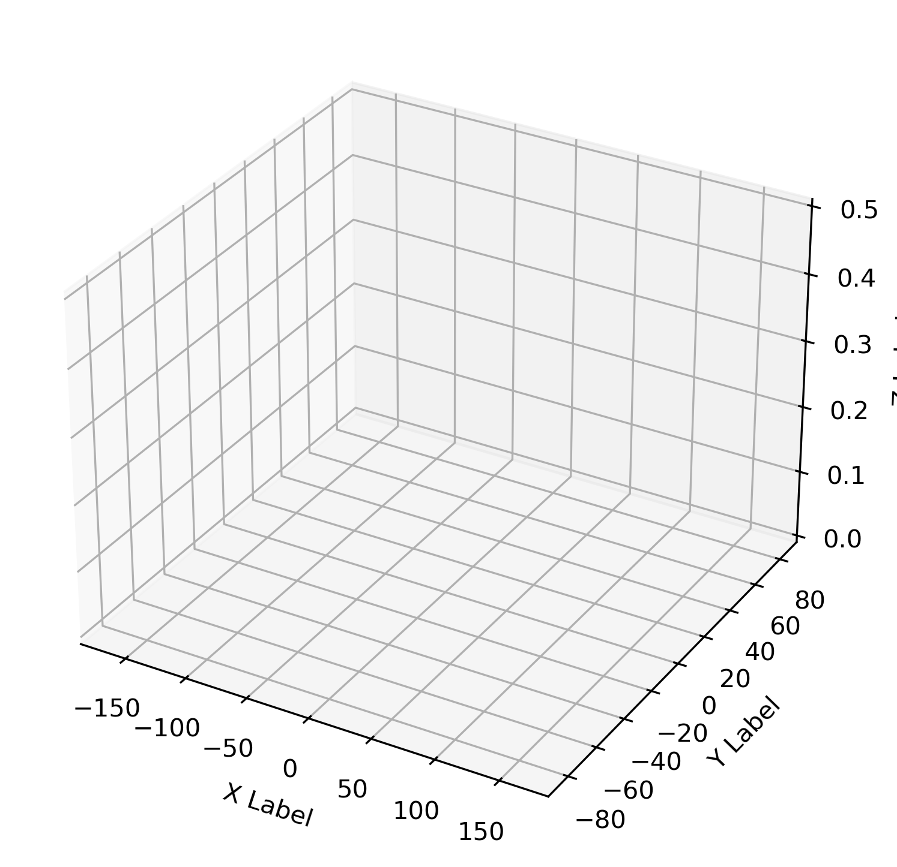
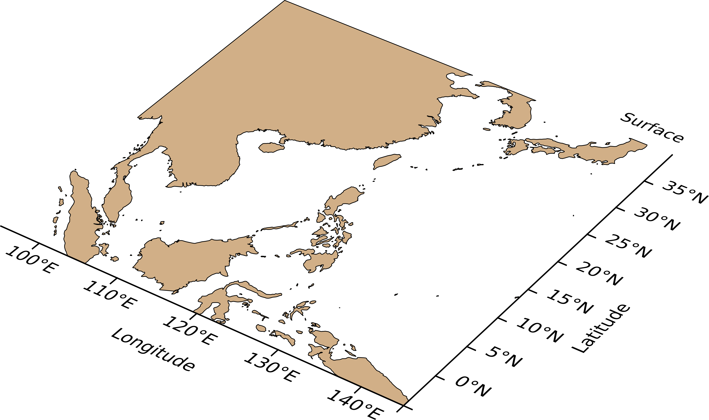

# Cómo mostrar mapas en proyección 3D usando Matplotlib y Cartopy
Por favor, consulte `test.py`

El gráfico 3D simple:

Los resultados finales son:

## Referencias en chino
[1] [气象绘图加强版-三维地图](https://mp.weixin.qq.com/s?__biz=MzIxODQxODQ4NQ==&mid=2247484444&idx=1&sn=fbfde1f6012c084daf9d71e71157ae6d&chksm=97eb9846a09c115001ba45c84c1d48580f7c8e67d5f76285cbe9e14f928cd727d19f286a09f3&scene=21#wechat_redirect)

[2] [气象绘图编程|绘制复杂的三维地图](https://mp.weixin.qq.com/s/zPp1DZSbGnorzAVjijzIBw)

[3] [Python气象绘图加强版：3D图形迁移](https://mp.weixin.qq.com/s/-wEcmSGM08GO0IgAsPvHfQ)

> Los ejemplos y códigos utilizados en estos artículos de Wechat hacen referencia a Stack Overflow

## Referencias en inglés (también soluciones nativas)
[1] [python - 3D CartoPy similar to Matplotlib-Basemap - Stack Overflow](https://stackoverflow.com/questions/23785408/3d-cartopy-similar-to-matplotlib-basemap)

[2] [python - contourf in 3D Cartopy - Stack Overflow](https://stackoverflow.com/questions/48269014/contourf-in-3d-cartopy)

[3] [cartopy - set_extent() extending requested boundary - Stack Overflow](https://stackoverflow.com/questions/43470238/cartopy-set-extent-extending-requested-boundary)
